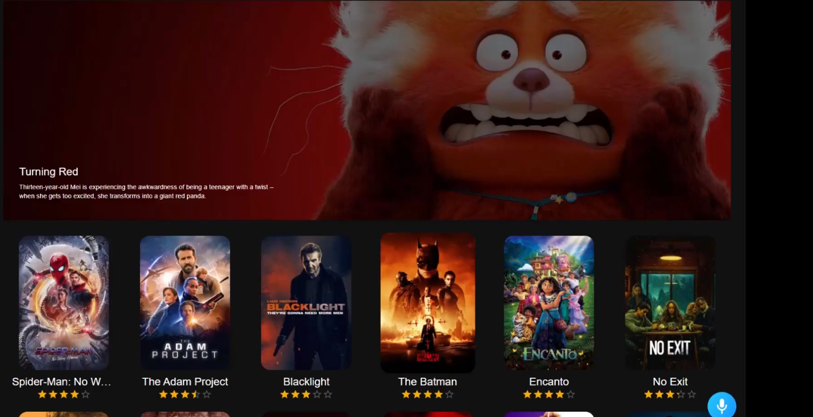

# 📋 APPENDIX



<p>
  
  
  
</p>

1.🌲[INTRODUCTION](#introduction)\
2.💰[TECH STACK](#tech)\
3.🏦[FEATURES](#features)\
4.🧾[INSTALLATION](#installation)

## 🌲INTRODUCTION

This is the movies site to display the movies with the smooth UI and AI powered voice assistent using ReactJs , Redux and Material UI

## 💰TECH STACK

ReactJs\
Redux\
Alan AI\
Material UI

## 🏦Features

👉**Movie Recommendations**\
🎬 Personalized movie suggestions based on user preferences and behavior for an enriched viewing experience.\
\
👉**Search functionality**\
🔍 Efficient search functionality allows users to quickly find their favorite movies or explore new titles.\
\
👉**Authentication**\
🔐 Secure user authentication ensures a personalized and protected experience for each individual.\
\
👉**Pagination**\
📑 Seamless pagination enhances user experience by breaking down movie lists into manageable pages.\
\
👉**Light/dark mode toggle**
🌞🌚 User-friendly light/dark mode toggle accommodates diverse preferences for a visually comfortable experience.

## Installation

Follow these steps to set up the project locally on your machine.
Install my-project with npm
Prerequisites
Make sure you have the following installed on your machine:

### Version Control with Git

- [Git Documentation](https://git-scm.com/doc)
- Official documentation for Git, the distributed version control system.

### Node.js

- [Node.js Official Website](https://nodejs.org/)
  - Node.js is a JavaScript runtime built on Chrome's V8 JavaScript engine.
  ### npm (Node Package Manager)
  - [npm Documentation](https://docs.npmjs.com/)
  - Official documentation for npm, the package manager for Node.js.
  ```bash
  npm install my-project
  cd my-project
  npm start
  ```
