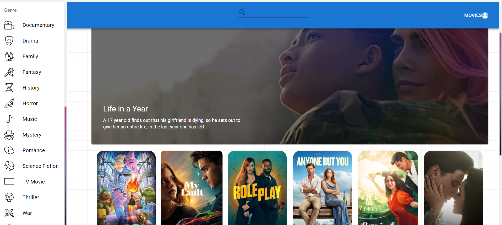

# 📋 APPENDIX



<p align="center">
  
  
  
</p>

1.🌲[INTRODUCTION](#introduction)\
\
2.💰[TECH STACK](#tech-stack)\
\
3.🏦[FEATURES](#features)\
\
4.🧾[INSTALLATION](#installation)

## 🌲INTRODUCTION

This is the movies site to display the movies with the smooth UI and AI powered voice assistent using ReactJs , Redux and Material UI

## 💰TECH-STACK

ReactJs\
Redux\
Material UI

## 🏦FEATURES

\
👉**Movie Recommendations**\
\
🎬 Personalized movie suggestions based on user preferences and behavior for an enriched viewing experience.\
\
\
👉**Home Page**\
\
🎬Showcases a visually appealing display of cars fetched from a third-party API, providing a captivating introduction to the diverse range of vehicles available.\
\
👉**Search functionality**\
\
🔍 Efficient search functionality allows users to quickly find their favorite movies or explore new titles.\
\
👉**Authentication**\
\
🔐 Secure user authentication ensures a personalized and protected experience for each individual. We Used the Authentication from TMDB Api documentation\
\
👉**Pagination**\
\
📑 Seamless pagination enhances user experience by breaking down movie lists into manageable pages.\
\

## INSTALLATION

Follow these steps to set up the project locally on your machine.
Install my-project with npm
Prerequisites
Make sure you have the following installed on your machine:

### Version Control with Git

- [Git Documentation](https://git-scm.com/doc)
- Official documentation for Git, the distributed version control system.

### Node.js

- [Node.js Official Website](https://nodejs.org/)
- Node.js is a JavaScript runtime built on Chrome's V8 JavaScript engine.

### npm (Node Package Manager)

- [npm Documentation](https://docs.npmjs.com/)
- Official documentation for npm, the package manager for Node.js.

```bash
npm install my-project
cd my-project
npm start
```
